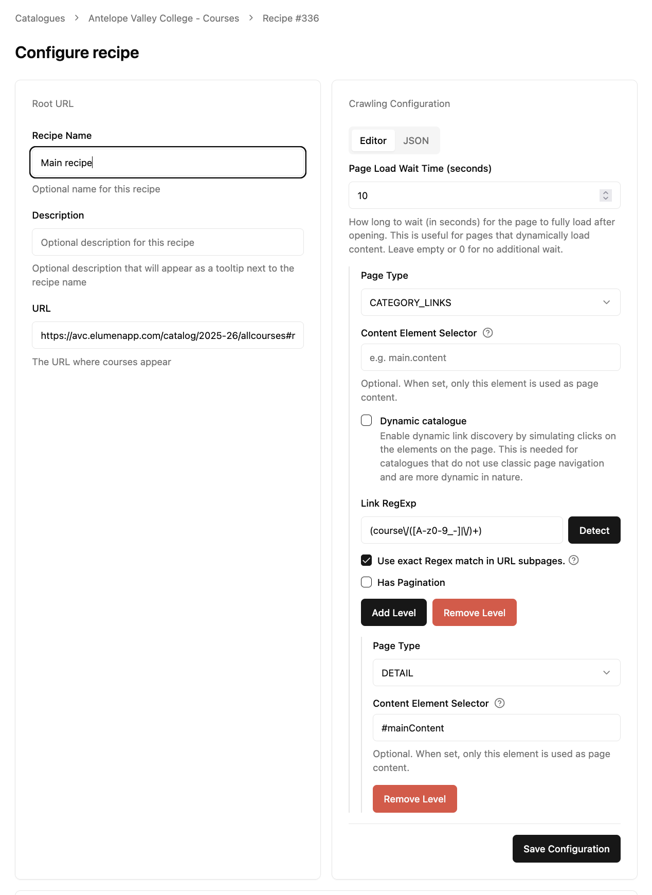
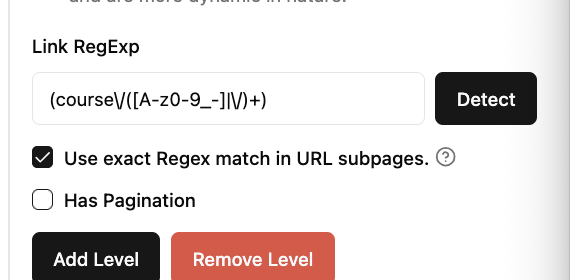
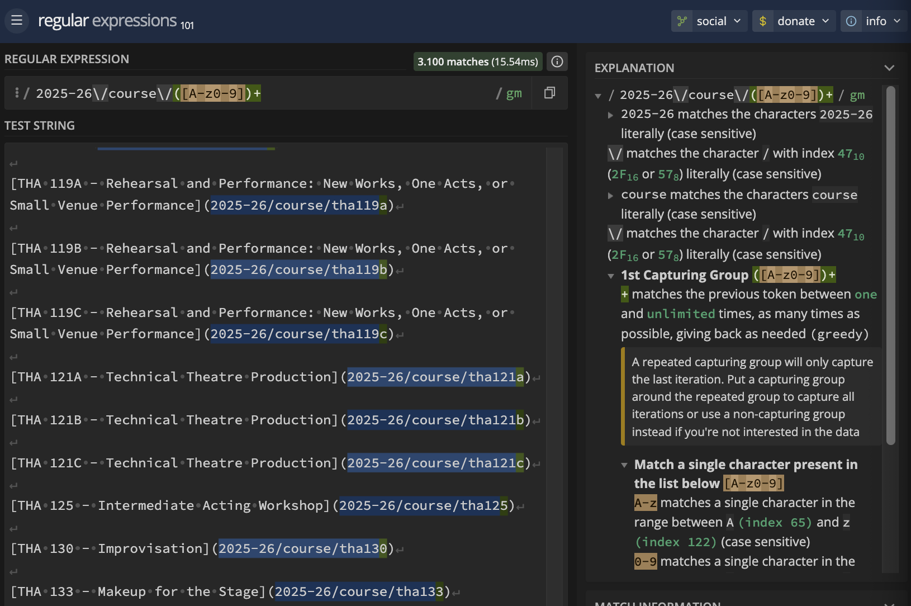
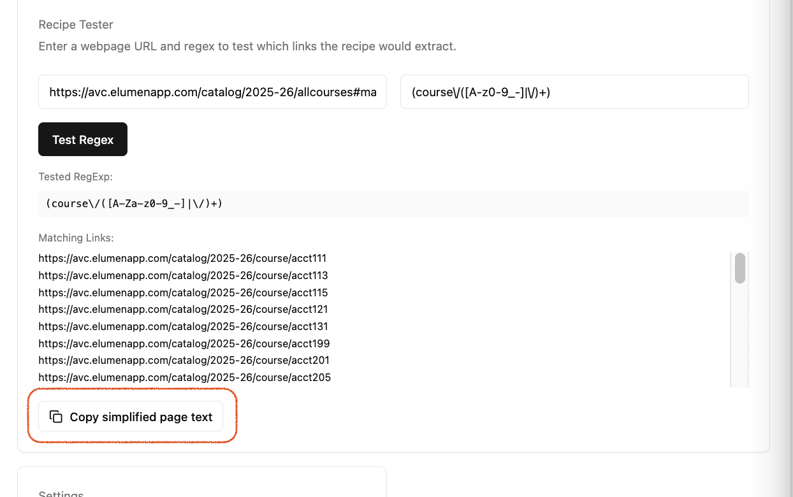

# Recipe Options Guide

This guide explains every option available when configuring a **recipe** in CTDL xTRA. Recipes define how the system crawls and extracts data from institution websites. 



---

## Table of Contents

1. [Overview: What is a Recipe?](#overview-what-is-a-recipe)
2. [Recipe Levels (Hierarchy)](#recipe-levels-hierarchy)
3. [Page Load Wait Time](#page-load-wait-time)
4. [Page Types](#page-types)
5. [Link RegExp (Link Pattern)](#link-regexp-link-pattern)
6. [Dynamic Catalogue (Click-Based Discovery)](#dynamic-catalogue-click-based-discovery)
7. [Pagination](#pagination)
8. [Exact Link Pattern Match](#exact-link-pattern-match)
9. [Testing Your Recipe](#testing-your-recipe)

---

## Overview: What is a Recipe?

A **recipe** tells xTRA how to navigate an institution’s website and where to find the data you want (courses, learning programs, competencies, or credentials). It answers:

- **Where to start** — the catalogue URL
- **What kind of page** each step is (links page, category page, or detail page)
- **How to find links** — via links on the page or by simulating clicks
- **How pagination works** — if the site splits content across multiple pages

Recipes can have multiple **levels** (steps). For example: start at a main index → follow category links → follow item links → extract from detail pages.

### Catalogue URL

The **Catalogue URL** is the starting point for the crawl. Choose the page that best represents the entry point for the content you want:

- **For courses:** Often the main course catalog index (e.g., `https://catalog.example.edu/courses`) or a page that links to departments/subjects.
- **For learning programs:** The programs overview page or a page linking to degree/certificate lists.
- **For competencies or credentials:** The page that links to the relevant sections.

**Where to find it:** Open the institution's website, navigate to the section you want to extract, and copy the URL from your browser's address bar. Avoid URLs that include session IDs or temporary tokens, as they may expire.

---

## Recipe Levels (Hierarchy)

Recipes can have multiple **levels** (steps). Each level has its own page type and options. Levels are nested: one level's `links` configuration defines the next level.

### How it works

1. **Level 1:** Start at the catalogue URL.  
   - If `DETAIL`: extract and stop.  
   - If `DETAIL_LINKS` or `CATEGORY_LINKS`: find links, then go to Level 2.
2. **Level 2:** For each link from Level 1, open that page.  
   - If `DETAIL`: extract.  
   - If `DETAIL_LINKS` or `CATEGORY_LINKS`: find more links, then go to Level 3.
3. **Level 3 and beyond:** Same logic, until you reach `DETAIL` pages.

### Example structures

**Simple (one level):**  
Catalogue URL → `DETAIL` (all data on one page)

**Two levels:**  
Catalogue URL → `DETAIL_LINKS` → `DETAIL`  
(e.g., course index → course detail pages)

**Three levels:**  
Catalogue URL → `CATEGORY_LINKS` → `DETAIL_LINKS` → `DETAIL`  
(e.g., main index → department pages → course list → course detail)

### Add Level / Remove Level

- **Add Level:** Use when the current level links to another index or category page, not yet to detail pages.
- **Remove Level:** Use to delete the current level and its children.

---

## Page Load Wait Time

**Location:** Top of the recipe configuration form  
**Type:** Number (seconds)  
**Default:** 0

### What it does

Adds an extra wait after the page loads before xTRA starts processing it. This gives the page time to show content that appears after the initial load.

### When to use it

- **Use it when:** The site loads content gradually and links or text appear only after a short delay.
- **Leave at 0 when:** The page content is visible immediately and does not change after load.

### How to determine the value

1. Open the catalogue page in a browser.
2. Use a slow connection (or your browser’s network throttling, if available).
3. Note how many seconds it takes for the main content (links, lists, etc.) to appear.
4. Set **Page Load Wait Time** to that value (or slightly higher).

**Example:** If links appear after about 3 seconds, set it to `3`.

---

## Page Types

**Location:** Each level of the recipe  
**Options:** `DETAIL`, `CATEGORY_LINKS`, `DETAIL_LINKS`, `API_REQUEST`, `EXPLORATORY`

Page type describes what kind of content is on the page and what xTRA should do next.

### DETAIL

**Meaning:** This page contains the full information for a single item (course, program, competency, or credential). xTRA should extract data from it and stop following links.

**When to use:** The page shows one item’s details (name, description, credits, etc.) and no further links to other items.

**Where to find this:** Usually the final page in a path, e.g.:
- A course detail page with course code, name, description, credits
- A program page with program name and description
- A competency or credential detail page

**Example:** `https://catalog.example.edu/courses/ACCT-101` showing “ACCT 101 – Financial Accounting” with full description.

---

### DETAIL_LINKS

**Meaning:** This page mainly lists links to detail pages. Each link goes to a single item’s detail page.

**When to use:** The page shows a list of items (e.g., course codes and names) where each link leads to a detail page.

**Where to find this:** Often an index or search results page, e.g.:
- A page listing all courses in a department
- A page with links like “ACCT 101 – Financial Accounting”, “ACCT 102 – Managerial Accounting”

**Example:** `https://catalog.example.edu/courses/accounting` with links to individual course pages.

---

### CATEGORY_LINKS

**Meaning:** This page links to category or grouping pages, not directly to detail pages. You need to go through these category pages to reach the detail links.

**When to use:** The site is organized in categories (departments, subjects, programs) and you must click into a category before seeing item links.

**Where to find this:** Main index or hub pages, e.g.:
- “Accounting”, “Biology”, “Computer Science” as links
- “Undergraduate Programs”, “Graduate Programs”
- Links to subject areas or departments

**Example:** `https://catalog.example.edu/courses` with links like “Accounting”, “Biology”, “Chemistry” instead of individual courses.

---

### API_REQUEST and EXPLORATORY

These are used for special integrations (e.g., API-based catalogues) and exploratory crawling. They are not typically used when configuring recipes manually.

---

## Link RegExp (Link Pattern)



**Location:** Each non-DETAIL level  
**Type:** Text (link pattern)

### What it does

A **pattern** that matches the URLs xTRA should follow for extractions. Not all links in a page are relevant so this filters which links on the page are used for the next step (next recipe level). The syntax uses RegExp (regular expressions) - which is very common when dealing with text. The reason we need it is because links in pages have slight variations but use a common pattern. Example:
```
1. https://avc.elumenapp.com/catalog/2025-26/course/acct111
2. https://avc.elumenapp.com/catalog/2025-26/course/acct205
```
Notice how most text of the link is the same and just the end is different. We use RegExp to tell xTRA that we're looking for links that start in a way and we expect the end to vary but in a certain way.

If we look at how xTRA sees the page (Copy simplified page text, from Recipe Tester), we find the same links above are seen as:
```
[ACCT 111 - Bookkeeping](2025-26/course/acct111)
[ACCT 113 - Bookkeeping II](2025-26/course/acct113)
```
This something called Markdown and unlike HTML, it is much easier for the AI models to reason about than the HTML web pages use to display content.

So, we need to use RegExp to tell extra to pick up `2025-26/course/acct111` and `2025-26/course/acct113`.

For these two examples, the right pattern is:
`2025-26\/course\/([A-z0-9])+`

We can think of the pattern in 3 groups
- `2025-26` - this is an exact match, so we expect to see 2025-26 text as it is.
- `\/course\/` - this matches `/course/` but we need to escape `/` with a `\` because `/` on its own has special meaning in the RegExp syntax so we need to tell it to not treat it as such.
- `([A-z0-9])+` - Matches anything in the rage of A to z or 0 to 9, so both upper and lower case letters or any digit. The `+` sign tells RegExp to allow matching one or more characters that conform to the range. But why won't this include the rest of the page? Because we notice in the text that xTRA sees above that we have a bracket: `)`. Since this does not conform to our range, the expression stops before `)` is encountered, leaving us with `2025-26/course/acct111`. If there would be no bracket, then the RegExp would still stop because because at the end there is a new line. And new lines are also considered characters but our range only matches A-z, 0-9, so new line characters are also not in the specified range.

Sites like [regex101.com]() have an explanation feature and can be used for other examples.


### When to use it

- **Required for:** `DETAIL_LINKS` and `CATEGORY_LINKS` pages.
- **Not used for:** `DETAIL` pages (no links to follow).

### Where to get the pattern

1. **Use the Detect button** — xTRA can analyze the page and suggest a pattern.
2. **Inspect links manually:**
   - Right-click a relevant link → “Copy link address”.
   - Look at the URL structure (path, parameters).
   - Identify the part that changes per item (e.g., course code, ID).

**Examples:**

| Site structure | Example URL | Possible pattern |
|----------------|-------------|------------------|
| Course IDs in path | `/courses/ACCT-101` | `course[s]?\/([A-Za-z0-9\-]+)` |
| Query parameter | `?coid=12345` | `coid=(\d+)` |
| Category slugs | `/catalog/accounting` | `catalog\/([a-z]+)` |

### Tips

- Start with the **Detect** button and adjust if needed.
- Use the **Recipe Tester** (see [Testing Your Recipe](#testing-your-recipe)) to verify which links match.
- If the pattern is too broad, you may get links to non-target pages (e.g., navigation, footer).
- If it is too narrow, you may miss valid links.

### Troubleshooting when links are not detected

If the Recipe Tester shows "No links matched" or misses links you expect, you can use these approaches:

**1. Use the "Copy simplified page text" button with an LLM**

After running a test in the Recipe Tester, click **Copy simplified page text**. This copies the page content as xTRA sees it (links and text). 



Paste it into an AI assistant (e.g., ChatGPT, Claude) and ask it to suggest a pattern that would match the links you need.

**Example prompt:**

> I'm configuring a web crawler to extract links from a course catalogue. Below is the simplified text of a page. I need a regex pattern that matches only the links to individual course detail pages (e.g., links that contain course codes like ACCT 101 or similar). Ignore navigation links, footer links, and links to category pages. The pattern will be used in JavaScript/Node.js.
> 
> ```
> [Paste the copied simplified page text here]
> ```
> Please give me a regex pattern that captures the course detail URLs. Explain what the pattern does in simple terms.

The LLM can analyze the link structure and suggest a pattern. Test the suggestion in the Recipe Tester and refine as needed.

---

**2. Online regex testers**

Search for "regex tester" or "regex101" online. Paste your pattern and a sample URL (or a line from the simplified page text that contains a link). The tester will show whether the pattern matches and which part it captures. This helps you spot typos, missing escape characters, or patterns that are too strict.

## Dynamic Catalogue (Click-Based Discovery)

**Location:** Checkbox for each non-DETAIL level  
**Type:** Checkbox (on/off)

### What it does

When enabled, xTRA will **simulate clicks** on the page and record a link only when the **URL changes** after a click. It clicks each element, waits for the address bar to change (either by navigating to a new page or by the site updating the URL in place), and then records that new URL. 

### Why this is needed

This is needed because some catalogues don't use regular page links. Normally, xTRA is able to see all links and their destinations in the page.

However, some catalogues have some scripting logic that perform some action and _then_ ask the browser to navigate. To achieve this behavior, pages usually leave the link destinations as blank or use "javascript:void(0)" as destination. This leads to the said URLs not being present in the simplified page xTRA uses or they are captured with destination "javascript:void(0)" - which is, unusable. To find the URLs in this case we must allow the page to complete its "on-link-clicked" logic in the browser that we trigger with a simulated click on the said element.

**Important:** xTRA only records URLs that change after a click. If you click something that simply reveals more content on the same page — for example, a section that expands when you click it, a "Show more" button, or a dropdown that opens without taking you to a new page — that content is already included when the page is processed. In those cases, leave Dynamic catalogue **off**. Ultimately, to see what content xTRA sees of a page, you can use the page link in the Recipe Tester in any of the recipe screens (the tester works with any URL and pattern - click Test Regex, wait for the page to load and then use "Copy simplified page text" button that shows up) 


### When to use it

- **Use it when:**
  - Links to courses or sub sections don't have a URL or use "javascript:void(0)". To see if this is the case, right click a sample page link and click "Copy Link Address". If the address is empty or "_blank" or "javascript:void(0)". This option is needed.
- **Leave it off when:**
  - The links in the page act like normal links, you are able to copy their address and navigate by pasting the address in a new tab

### Required when enabled: Dynamic URL Selector

**Location:** Shown when Dynamic catalogue is checked  
**Type:** Text (CSS selector)

**What it is:** The selector identifies the **area of the page** where xTRA should look for clickable items. xTRA finds the first element that matches your selector, then looks for all clickable elements inside it (links, buttons, and anything that looks clickable). It does **not** select the items to click — it selects the **container** that holds them.

**How it works:**
1. xTRA loads the page and waits for it to finish loading.
2. It scrolls to the bottom (to reveal any content that loads when you scroll).
3. It finds the container element using your selector.
4. Inside that container, it finds all elements that are clickable (links, buttons, or elements with a pointer cursor).
5. For each clickable element, it clicks it and waits up to 15 seconds for the URL to change.
6. **If the URL changes:** xTRA records the new URL, goes back to the starting page, and continues with the next element.
7. **If the URL does not change** (e.g., a dropdown opens, or a "Show more" expands content on the same page): xTRA waits the full 15 seconds, then **the process fails with an error**. It does not skip and continue — the extraction stops.
8. **If the element cannot be clicked** (e.g., it is obscured or not yet visible): xTRA skips that element and continues with the next one.

**Important:** Use a selector that targets only the area with links that navigate to new pages. If the container includes buttons or links that do not change the URL (dropdowns, expand buttons, etc.), the process will fail when it clicks one of them. Narrow your selector to avoid those elements.

**How to choose the right selector:**
- **Start with `body`** if you are unsure — this tells xTRA to look everywhere on the page. It works but is slow and may click navigation, footer, and other links you do not need. The resulting links will still go through the recipe RegExp pattern, it'll just take longer to collect all page links and in some extreme cases the extraction maximum allowed time could be exceeded marking it as 'stale'.
- **Use a more specific selector** to limit the area and speed things up. The goal is to target the section that contains the links you want (e.g., the main content area, a list, or a table).

**Step-by-step: finding a selector**

1. Open the catalogue page in your browser.
2. Right-click on the **container** that holds the links you want (e.g., the main content area, a list of courses, or a table) — not on an individual link.
3. Choose **Inspect** (or **Inspect Element**). The developer tools will open and highlight that element.
4. In the highlighted code, look for:
   - An `id` attribute (e.g., `id="main-content"`) → use `#main-content`
   - A unique `class` (e.g., `class="course-list"`) → use `.course-list`
   - A combination (e.g., `class="content"` inside a div with `id="catalog"`) → use `#catalog .content`
5. Type your selector in the Dynamic URL Selector field. If the element has an id, `#` followed by the id is usually the simplest (e.g., `#course-list`).

**If the selector does not work:** xTRA will report that no element was found. Check that the selector matches exactly (including spelling and symbols like `#` and `.`). The element must exist when the page loads — if it appears only after a click, use a selector for a parent that is always present.


### Click Limit

**Location:** Under Dynamic catalogue  
**Type:** Number (default: 300)

**What it does:** Maximum number of clickable elements xTRA will process. If the page has **more** clickable elements than this number, the process stops with an error. This is a safety cap to avoid very long runs.

**When to adjust:** Set this to a value at least as high as the number of links you expect. For example, if a department has 50 courses, use at least 50. If the page has 400 clickable items and you need them all, set it to 400 or higher (up to 10,000). If you get an error saying the limit was exceeded, increase this value.

### Wait (ms)

**Location:** Under Dynamic catalogue  
**Type:** Number (milliseconds, optional)

**What it does:** How long xTRA will wait for the page to load and for your selector to appear. Default is 30 seconds. If the page or selector takes longer to appear, increase this value (e.g., 45000 for 45 seconds, up to 60000).

**When to use:** Leave empty to use the default. Increase only if the page loads slowly or you see timeouts. This does **not** add a delay after each click — it only affects how long xTRA waits for the initial page load.

---

## Pagination

**Location:** Each non-DETAIL level  
**Type:** Checkbox + configuration

### What it does

Tells xTRA that the content is split across multiple pages (e.g., “Page 1 of 10”) and how to build URLs for each page.

### When to use it

- **Use it when:** The page shows “Next”, page numbers (1, 2, 3…), or “Page X of Y”.
- **Leave it off when:** All content fits on a single page or there is no pagination.

### How to determine the settings

1. **Use the Detect button** — xTRA can analyze the page and suggest pagination settings.
2. **Inspect manually:**
   - Click “Next” or a page number.
   - Check how the URL changes (e.g., `?page=2`, `?offset=20`).
   - Check whether the first page starts at `1` or `0`. Most sites use `page=1`, but some catalogues use zero-based pagination like `page=0`, `page=1`, `page=2`.

### Pattern Type

**Options:** `page_num`, `offset`

- **page_num:** The URL uses a page number (1, 2, 3…).  
  Example: `https://catalog.example.edu/courses?page=2`
- **offset:** The URL uses an offset (0, 20, 40…).  
  Example: `https://catalog.example.edu/courses?offset=20`

### URL Pattern

**Format:** The full URL for a paginated page, with the changing part replaced by a placeholder:

- For `page_num`: use `{page_num}`  
  Example: `https://catalog.example.edu/courses?page={page_num}`
- For `offset`: use `{offset}`  
  Example: `https://catalog.example.edu/courses?offset={offset}`

### Total Pages

**Type:** Number

**What it is:** The total number of pages to crawl.

**Where to find it:** Look for “Page 1 of X” or the last page number on the site. If unsure, use a higher number; xTRA will stop when there is no more content.

### Start Page

**Type:** Number  
**Default:** `1`

**What it is:** The first page number xTRA should use when building `page_num` pagination URLs.

**When to change it:** Leave this as `1` for the usual `page=1`, `page=2`, `page=3` pattern. Set it to `0` when the catalogue starts at `page=0`, then continues with `page=1`, `page=2`, and so on.

**Example:** If URL Pattern is `https://catalog.example.edu/courses?page={page_num}`, Total Pages is `3`, and Start Page is `0`, xTRA crawls:

- `https://catalog.example.edu/courses?page=0`
- `https://catalog.example.edu/courses?page=1`
- `https://catalog.example.edu/courses?page=2`

---

## Exact Link Pattern Match

**Location:** Checkbox for each non-DETAIL level  
**Type:** Checkbox (on/off)  
**Default:** Off

### What it does

Controls how xTRA builds URLs for the next level:

- **Off (default):** Uses the full resolved URL (e.g., `/2025-2026/course/ACCT-101`).
- **On:** Uses only the part of the URL that matches the Link RegExp (e.g., `/course/ACCT-101`).

### When to use it

- **Use it when:** The site uses relative or context-dependent links that get duplicated when resolved.  
  Example: A link like `2025-2026/course/ACCT-101` on a page that is already under `/2025-2026/` can become `/2025-2026/2025-2026/course/ACCT-101` when resolved.
- **Leave it off when:** Links resolve correctly and you do not see duplicate path segments or wrong URLs.

**Recommendation:** Keep this **off** unless you see duplicate path segments or broken URLs in your extractions.


## Testing Your Recipe

### Recipe Tester (TestLinkRegex)

**Location:** On the recipe create/edit page (when manual configuration is enabled)

**What it does:** Lets you test the Link RegExp (and related options) against a real page URL. It shows which links would be extracted.

**How to use it:**
1. Enter the URL of a page you want to test (e.g., a course index).
2. Enter or paste your Link RegExp (or use the one from the recipe).
3. Click **Test URL Detection** or **Test Regex**.
4. Review the list of matching links.

**Interpretation:**
- If the list looks correct (only relevant links), the pattern is good.
- If you see navigation, footer, or unrelated links, tighten the pattern.
- If valid links are missing or you get "No links matched", see [Troubleshooting when links are not detected](#troubleshooting-when-links-are-not-detected) for tips on using online regex testers and LLMs with the "Copy simplified page text" button.

### Detect buttons

- **Detect** (next to Link RegExp): Analyzes the page and suggests a Link RegExp.
- **Detect** (next to Pagination): Analyzes the page and suggests pagination settings.

Use these when creating or tuning a recipe; you can still adjust the results manually.

---

## Quick Reference

| Option | When to use | Where to find the value |
|--------|--------------|--------------------------|
| **Page Load Wait Time** | Content appears gradually after load | Time until content appears (seconds) |
| **Page Type** | Always | Type of page (links, categories, or detail) |
| **Link RegExp** | For links/category pages | Detect button or by inspecting URLs |
| **Dynamic catalogue** | Links require URL change after click | Check if URL changes when you click; expanding sections on the same page don't need it |
| **Dynamic URL Selector** | When Dynamic catalogue is on | Inspect the page to find the right selector |
| **Click Limit** | Dynamic catalogue with many elements | Number of clickable elements |
| **Wait (ms)** | Page loads slowly | Max wait for page/selector (default 30s) |
| **Pagination** | Content split across pages | Detect button or inspect pagination |
| **Exact Link Pattern Match** | Duplicate path segments in URLs | Keep off unless needed |

---

## Getting Help

- Use **Detect** for Link RegExp and Pagination when possible.
- Use the **Recipe Tester** to verify link extraction.
- Start with a simple recipe (one or two levels) and add levels only if the site structure requires it.
- If extractions fail or return wrong data, check: page type, link pattern, pagination, and whether Dynamic catalogue is needed.
