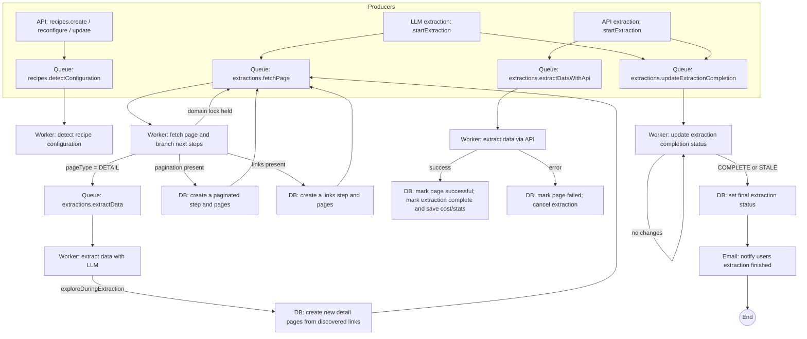

## Worker queues and background flow

### Queues
- **recipes.detectConfiguration**: Detects and stores a recipe configuration
  - Defined in `server/src/workers/index.ts`
  - Worker: `server/src/workers/detectConfiguration.ts`
- **extractions.fetchPage**: Fetches a page (via headless browser), persists content/screenshot, branches next steps
  - Defined in `server/src/workers/index.ts`
  - Worker: `server/src/workers/fetchPage.ts`
- **extractions.extractData**: LLM-based extraction from stored page content; may enqueue more pages
  - Defined in `server/src/workers/index.ts`
  - Worker: `server/src/workers/extractData.ts`
- **extractions.extractDataWithApi**: API-based extraction; completes extraction lifecycle
  - Defined in `server/src/workers/index.ts`
  - Worker: `server/src/workers/extractDataWithApi.ts`
- **extractions.updateExtractionCompletion**: Periodic job updating completion stats and final status
  - Defined in `server/src/workers/index.ts`
  - Worker: `server/src/workers/updateExtractionCompletion.ts`

### Producers (where jobs are enqueued)
- **Detect configuration**
  - `server/src/routers/recipes.ts` (`create`, `reconfigure`, `update`) → `Queues.DetectConfiguration`
  - `server/src/extraction/submitRecipeDetection.ts` → `Queues.DetectConfiguration`
- **Start extraction (LLM path)**
  - `server/src/extraction/startExtraction.ts` → `Queues.FetchPage` for root; repeatable `Queues.UpdateExtractionCompletion`
- **Start extraction (API path)**
  - `server/src/extraction/startExtraction.ts` → `Queues.ExtractDataWithAPI`; repeatable `Queues.UpdateExtractionCompletion`
- **Chaining inside workers**
  - `fetchPage.ts` → `Queues.ExtractData` (DETAIL) or bulk `Queues.FetchPage` (pagination/links)
  - `extractData.ts` → bulk `Queues.FetchPage` when exploring additional pages
  - `fetchPage.ts` re-enqueues `Queues.FetchPage` with delay when domain lock held

### Consumers and side effects
 - **detectConfiguration.ts**
  - DB:
    - Mark recipe as “in progress”
    - On success: save detected configuration and mark recipe “successful”
    - On failure: save a human-readable failure reason and mark recipe “error”
  - Emails: send success notice; on final retry failure, send failure notice

 - **fetchPage.ts**
  - Throttling: per-domain Redis lock; if another worker is fetching the same domain, put this job back with a delay
  - DB sequence:
    - If fetching the root page: mark extraction “in progress”
    - Mark page “in progress”
    - Fetch page via browser; save raw HTML and a simplified Markdown plus a screenshot; update page to point to stored content
    - Branch next step:
      - If pagination is configured: create a new step and pages for all paginated URLs and enqueue page fetches
      - If current page is a detail page: enqueue a data extraction for this page
      - If link-following is configured: create a new step and pages for discovered links and enqueue page fetches
    - Mark page “successful”
  - Errors: mark page “error” and store a structured failure reason

- **extract data with LLM (extractData.ts)**
  - DB:
    - Record when extraction starts for this page
    - Ensure a dataset exists for this extraction
    - For each extracted entity, store a data item with text inclusion metadata
  - Optional expansion: if entities were found and exploration is enabled, create a new links step with detail pages and enqueue additional page fetches

- **extract data via API (extractDataWithApi.ts)**
  - DB:
    - Start: mark page “in progress” and the extraction “in progress”; record the extraction start time
    - Stream batches of results; for each course, store a data item
    - Success: mark page “successful”; mark extraction “complete” and save completion statistics
    - Error: mark page “error”; mark extraction “cancelled”

 - **updateExtractionCompletion.ts**
  - Computes per-step completion and overall cost summary
  - If nothing changed since last run: keep waiting (up to 5 minutes if it looks complete but there may be pending jobs; up to 4 hours if it looks incomplete)
  - If there are changes: update the extraction’s completion stats
  - Finalization: set extraction status to “complete” or “stale”, remove the repeating job, and notify users by email
  - Also checks the queues to see if there are still jobs pending for this extraction

### Operational details
- **Queue setup**: `server/src/workers/index.ts`
  - Default job options: 3 attempts, exponential backoff (1s), remove on complete, keep failed for 5 days
  - Worker startup: `server/src/worker.ts` starts 5 processors with local concurrency (2 for most; 10 for completion updates)
- **Redis**: connection via `ioredis`; domain-based throttle in `fetchPage.ts`
- **Job IDs**: namespaced (e.g., `fetchPage.{id}`, `extractData.{id}`) with delayed requeue suffix `.delayed.{uuid}` when throttled

### Key files
- `server/src/worker.ts`
- `server/src/workers/index.ts`
- `server/src/workers/{detectConfiguration,fetchPage,extractData,extractDataWithApi,updateExtractionCompletion}.ts`
- `server/src/extraction/{startExtraction,submitRecipeDetection}.ts`
- `server/src/routers/recipes.ts`
- `server/src/data/{extractions,recipes,datasets}.ts`, `server/src/data/schema.ts`
